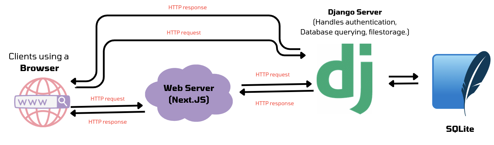

# ProblemHub Documentation

## Contents

- [ProblemHub Documentation](#problemhub-documentation)
  - [Contents](#contents)
  - [Tech stack](#tech-stack)
  - [Architecture](#architecture)
  - [Folder structure](#folder-structure)
  - [Development Cycle](#development-cycle)
    - [Cloning the repository](#cloning-the-repository)
    - [Environment variables](#environment-variables)
    - [Running the Development environment using Docker](#running-the-development-environment-using-docker)
    - [Running the development environment manually](#running-the-development-environment-manually)
  - [Common issues](#common-issues)

## Tech stack

- **Frontend**: 
  - **Next.js**: A fullstack react framework with easy routing, server-side rendering and ton of useful features. We use this to build the frontend of the application (i.e a webserver to serve web pages to the user).
  - **React**: A JavaScript library for building user interfaces and reusable UI components.
  - **TailwindCSS**: A CSS framework with utility classes (To avoid having to make .css files)
  - **Axios**: A library for making HTTP requests

- **Backend**:
  - Django: A python web framework for building web applications. We use this to build the backend of the application (i.e facilitating database, authentication APIs, RESTful API endpoints for frontend to interact with the database and file-storage).
  - SQLite: A lightweight SQL database. We use this to store the data of the application.

## Architecture



## Folder structure

- **/client**: Contains the codebase for the NextJS application.
- **/server**: Contains the codebase for the Django application.
  - **/uploaded_problems**: Contains the uploaded problems `.zip` files. This folder is in .gitignore, so if you need to migrate the application to a new server, you'll have to manually copy the files to the new server. This is done to avoid bloating the git repository.

Each of these folders have their own README.md documenting how to run each application manually. For the fakse of simplicity you should run it using [docker](#running-the-development-environment).

## Development Cycle

### Cloning the repository
Clone this repo using the following command:

```bash
git clone https://github.com/N0nameleft/Problem-Hub.git
```

### Environment variables

- Create a `.env` file in the `/client` and `/server` folder.
- `/client/.env`:
  - Should have the variables:
    - **BACKEND_API_URL**: The URL of the Django server. For example: `http://localhost:8000`
    - **BACKEND_SERVERSIDE_API_URL**: The URL of the Django server, when called on serverside. For example: `http://backend:8000`
      - Note: If you run the codebase manually, ie.. without docker, you should use the same value as BACKEND_API_URL for both the variables. If you use docker, this should simply be `http://backend:8000`

- `/server/.env`:
  - **DJANGO_SUPERUSER_USERNAME**: The username of the superuser. For example: `admin`
  - **DJANGO_SUPERUSER_PASSWORD**: The password of the superuser. For example: `admin`
  - **DJANGO_SUPERUSER_EMAIL**: The email of the superuser. For example: `admin@admin.com`

- Note: There should be sample .env files in both folders, rename them to `.env` or make your own.

### Running the Development environment using Docker

- Make sure you have docker engine and docker-compose installed. There are instructions available in [docs/docker-installation.md](docs/docker-installation.md).
- Run the command:

    ```sudo docker compose up```

    This should spin up the Next.js server as well as the Django server.

- As of 05/09/23, I haven't written a script to perform migrations before running the django server. I'll do that later, else, someone else can feel free to do that! ;P

### Running the development environment manually

1. Set up the environment variables. See [Environment variables](#environment-variables) for more details.

2. Run the Django server: (Docs: [server/README.md](server/README.md))

    ```bash
    cd server
    python3 -m venv venv
    source venv/bin/activate
    pip install -r requirements.txt
    python manage.py runserver
    ```

    - to make database migrations, run the following command:

        ```bash
        python manage.py makemigrations
        ```

    - to performance migrations, run the following command:

        ```bash
        python manage.py migrate
        ```

    - to create a superuser, run the following command:

        ```bash
        python manage.py createsuperuser
        ```

3. Run the Next.js server: (Docs: [client/README.md](client/README.md))

    ```bash
    cd client
    npm install
    npm run dev
    ```

    - to build the application, run the following command:

        ```bash
        npm run build
        ```

    - to run the application in production mode, run the following command:

        ```bash
        npm run start
        ```

    - to run the application in development mode, run the following command:

        ```bash
        npm run dev
        ```

    - to run the application in production mode, run the following command:

        ```bash
        npm run start
        ```
## Common issues

Open [docs/common-issues.md](docs/common-issues.md) to find out common issues and how to fix them. If you encounter any issues, please check that document.

## Common Problems

1. Building docker image on Mac devices
    There is a known common error occurs every time building a new docker image on a Mac device, it may also occur even if the device has been used for other docker images. 
    The easiest fix for this error will be:
    ```rm  ~/.docker/config.json```
