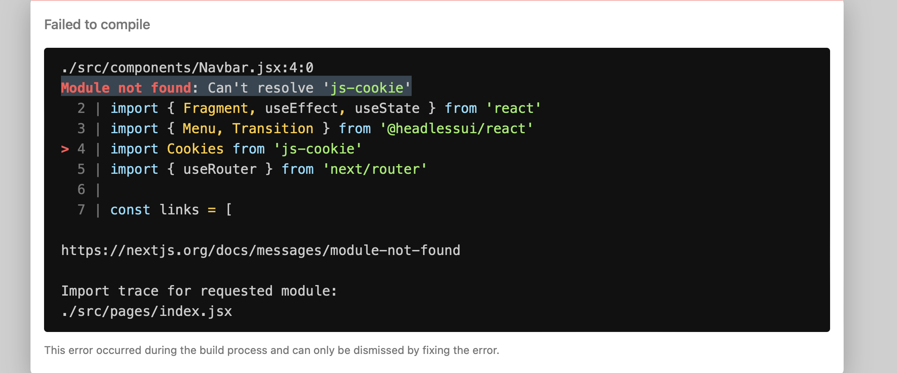

# Common Issues

and how to fix them.

## 1. Missing NPM Packages after building image with Docker compose

### Issue

- This one has been noticed on Mac devices.
- After building the image with Docker compose, the Next.js server fails to start because of missing NPM packages.
- 

### Fix

- This issue is caused by the Docker cache
- Run `rm  ~/.docker/config.json`

## 2. Files not up to date with latest code

### Fix

- Run `git pull` to update your local repository with the latest code.

- Check you're on the correct branch by running `git branch`
  - If you're not on the correct branch, run `git checkout <branch-name>` to switch to the correct branch.

- Run `docker compose up --build` to rebuild the image with the latest code.

## 3. Permission denied while trying to connect to the docker daemon socket...

### Issue

- This one may arise when you run `docker compose up` or any other docker command.

### Fix

- To mitigate this, you need to:
  
  a. Add your user to the 'docker' group:
  - `sudo usermod -aG docker $USER`

  b. Run `newgrp docker` to refresh the permissions i nthe current session
  
  c. Modify Docker's daemon configuration. Create a daemon.json file if it doesn't already exist:
  - `sudo mkdir -p /etc/docker`
  - `sudo touch /etc/docker/daemon.json`
  
  d. Add the following contents to the file (`nano /etc/docker/daemon.json`):
  
  ```json
  {
    "group": "docker"
  }
  ```

  e. Restart Docker:
  - `sudo systemctl restart docker`
